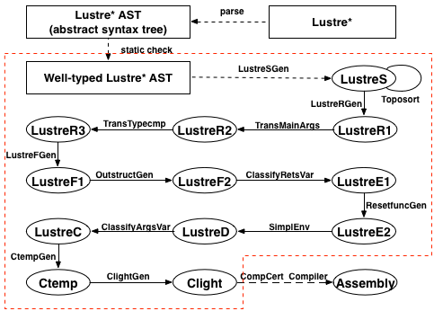

# L2C Project

---

Version 0.8

##Introduction

The goal of L2C project is to build a compiler to implement formally certified tranlation from a **Lustre**-like synchronous data-flow language which totally covers **Lustre V6** to **Clight**.
This open source version of L2C has completed the certified translation from a mono-clocked Lustre-like language to Clight. Next we will open the nested-clocked version.


> ####Nouns Explaination
>> #####Lustre
Lustre is a formally defined, declarative, and synchronous dataflow programming language, for programming reactive systems. see http://en.wikipedia.org/wiki/Lustre_(programming_language)
>> #####Lustre V6
Lustre V6 is a stable and popular version of Lustre programming language. see http://www-verimag.imag.fr/DIST-TOOLS/SYNCHRONE/lustre-v6/
>> #####Clight
Clight is a large subset of C programming language used in CompCert which is an existing formally certified compiler from Clight to assembly. see http://compcert.inria.fr

> ####Framework
>> The framework of L2C is shown below. This open source version complete the formally certified translation from Well-typed Lustre* AST to Clight as the red box covers.<br/><br/>



---
## Get Started

> ####Environment:

- The Coq Proof Assistant, version 8.4pl3 (July 2015)
- The Objective Caml compiler, version 4.02.1
- Pproofgeneral 4.2

> ####Installation:

- make
- make install (**option**)
-- install l2c to ~/bin

> ####Test

- make test
-- compile ast files into c files

> ####Uninstallation

- make uninstall
-- remove ~/bin

---
## How To Use

**USAGE** 
```
l2c [options] <source.ast>
```

**options**
>	**-save-temp**:		Save temporary intermediate files

>   **-ctemp**:                 Output ctemp source
	
>	**-target_dir `<dir>`**:	Set the directory of target files to `<dir>`

>	**-o `<file>`**:		Indicate the output file name

>	**-version**:		Print version information

>	**-help**:			Print this usage message

---
##Website

More Details, see http://soft.cs.tsinghua.edu.cn:8000/